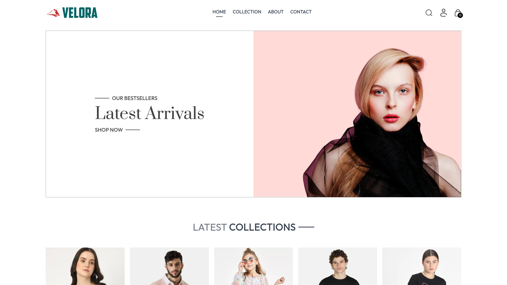
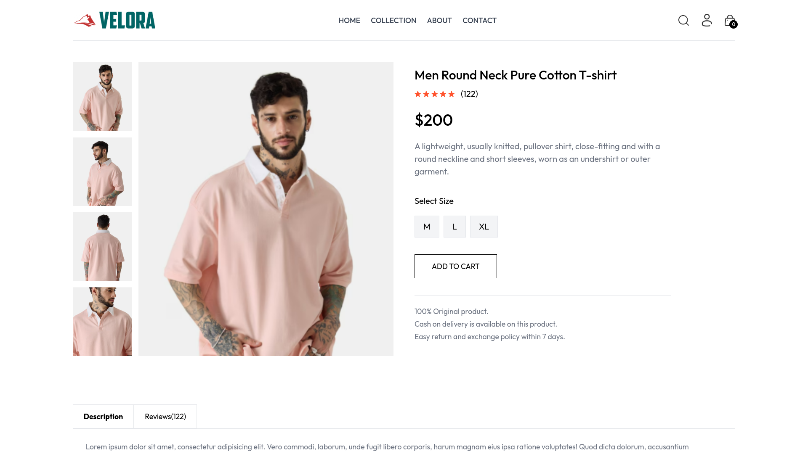
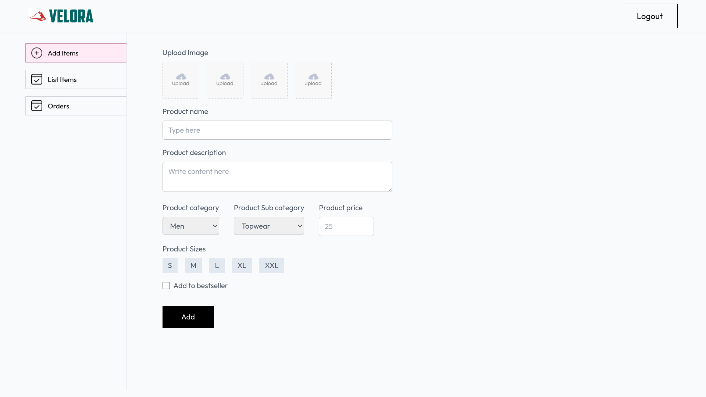

# Velora - Revolutionizing E-Commerce with MERN Stack


Welcome to **Velora**, a cutting-edge e-commerce platform built to redefine the online shopping experience. Crafted with precision using the **MERN** stack (MongoDB, Express, React, Node.js), Velora delivers a seamless, intuitive, and robust solution for modern e-commerce needs. Whether you're a developer, entrepreneur, or business owner, Velora equips you with the tools to run a highly scalable, secure, and efficient online store.

> **Velora** is more than just a project—it's an innovation, setting new benchmarks for performance, scalability, and user experience. Deployed with the power of **Vercel**, Velora guarantees high availability and top-tier performance.

## 🌐 Live Demo

- **Admin Panel:** [https://velora-admin-panel.vercel.app](https://velora-admin-panel.vercel.app)
- **E-Commerce Platform:** [https://velora-two.vercel.app](https://velora-two.vercel.app)

---

## 📖 Table of Contents

- [Overview](#-overview)
- [Features](#-features)
- [Tech Stack](#-tech-stack)
- [Project Architecture](#-project-architecture)
- [Installation Guide](#-installation-guide)
- [Configuration](#-configuration)
- [Running the Application](#-running-the-application)
- [API Documentation](#-api-documentation)
- [Screenshots](#-screenshots)
- [Deployment Instructions](#-deployment-instructions)

---

## 📊 Overview

Velora offers a holistic approach to e-commerce, where technology meets user-centric design. The platform is packed with features that make it ideal for launching online stores of any size. With the seamless integration of **Stripe** for payment handling and **MongoDB** for scalable storage, Velora guarantees top-tier functionality, both for end-users and administrators.

---

## 🚀 Features

### 💼 Admin Panel
- **Advanced Product Management**: Add, edit, and remove products with ease, complete with image uploads and detailed descriptions.
- **Comprehensive Order Management**: Track and update order statuses, ensuring smooth logistics.
- **User Administration**: Manage users, monitor their activity, and provide the best shopping experience.
- **Real-Time Analytics**: Get insights into product sales, revenue generation, and inventory management.

### 🛒 User Experience
- **Smart Product Filtering**: Browse a wide range of products with real-time filtering and sorting options.
- **Dynamic Cart Management**: Add, update, and remove items from the cart in real-time, ensuring a smooth checkout process.
- **Multiple Payment Options**: Secure payment with **Stripe** integration, along with a cash-on-delivery option for flexibility.
- **Order History and Tracking**: Users can track their order status from purchase to delivery.
- **Responsive & Optimized UI**: Fully responsive design that adapts to any device, enhancing the user experience.

### 🌍 Platform Stability
- **JWT Authentication**: Secure login system to protect sensitive user data and sessions.
- **Cloudinary Integration**: For efficient image management, including product images.
- **Multi-Environment Deployment**: Supports smooth development, testing, and production environments through well-configured **Vercel** deployments.

---

## 🛠 Tech Stack

Velora leverages the power of modern technologies to deliver a high-performing platform:

### Frontend
- **React.js** with **Vite**: Ensures fast development and lightning-speed builds.
- **Tailwind CSS**: For clean, responsive, and modern UI design.
- **Axios**: For simplified HTTP requests to the backend.
- **React Toastify**: Provides a smooth, interactive user notification system.

### Backend
- **Node.js** and **Express.js**: Provides a flexible and scalable backend solution.
- **MongoDB** with **Mongoose**: Ensures fast and scalable database management.
- **JWT Authentication**: Guarantees secure user sessions and API interactions.
- **Multer**: For efficient file uploads, especially for product images.
- **Stripe API**: Facilitates secure and fast online payments.
  
---

## 🏗 Project Architecture

Velora is divided into three major parts, each with a distinct role:

```bash
Velora/
├── admin/               # Admin Panel for backend operations
│   ├── src/             # Core React code for admin functionalities
│   ├── public/          # Public assets such as logos and icons
│   └── ...              # Admin Panel configurations
├── client/              # E-commerce customer-facing app
│   ├── src/             # Core React code for customer store
│   ├── public/          # Public-facing assets
│   └── ...              # Client configurations
├── server/              # Backend server for API and business logic
│   ├── controllers/     # Request controllers for different API endpoints
│   ├── models/          # Mongoose models for MongoDB collections
│   ├── routes/          # Express routes for API handling
│   └── ...              # Backend utilities and configurations
└── README.md            # Comprehensive project documentation
```

---

## 📦 Installation Guide

### Prerequisites:
- **Node.js** (v14 or higher)
- **MongoDB** (A local or cloud instance like MongoDB Atlas)
- **Vite** (For frontend builds)

1. **Clone the repository:**
    ```bash
    git clone https://github.com/your-username/velora.git
    cd velora
    ```

2. **Install dependencies for the client:**
    ```bash
    cd client
    npm install
    ```

3. **Install dependencies for the admin panel:**
    ```bash
    cd ../admin
    npm install
    ```

4. **Install dependencies for the backend:**
    ```bash
    cd ../server
    npm install
    ```

---

## 🔧 Configuration

### Backend (server/.env)

You will need to set up the following environment variables in the **server** directory:

```bash
MONGO_URI=your_mongo_db_uri
JWT_SECRET=your_jwt_secret_key
CLOUDINARY_CLOUD_NAME=your_cloudinary_name
CLOUDINARY_API_KEY=your_cloudinary_api_key
CLOUDINARY_API_SECRET=your_cloudinary_api_secret
STRIPE_SECRET_KEY=your_stripe_secret_key
```

### Frontend (client/.env and admin/.env)

For the **client** and **admin** directories:

```bash
VITE_API_URL=https://your-backend-url
```

---

## 💻 Running the Application

### Backend (Server)
```bash
cd server
npm run dev
```

### Frontend (Client - E-Commerce Store)
```bash
cd client
npm run dev
```

### Admin Panel
```bash
cd admin
npm run dev
```

The application will be available at:

- **E-commerce Store (Frontend):** \`http://localhost:5173\`
- **Admin Panel (Admin):** \`http://localhost:5100\`
- **Server:** \`http://localhost:5000\`

---

## 📚 API Documentation

### Key Endpoints

- **User Registration/Login**: Authenticate users and generate JWT tokens.
- **Product Management**: Admin APIs to create, update, and delete products.
- **Order Processing**: Manage customer orders, verify payments, and handle order statuses.
- **Stripe Payment**: Secure online payments through Stripe’s payment gateway.
  
---

## 🖼 Screenshots

### Home Page


### Product Details Page


### Admin Dashboard


---

## 🌐 Deployment Instructions

Velora is deployed on **Vercel** for both frontend and backend. To deploy your own version:

1. **Frontend and Admin Panel:** Deploy the `client` and `admin` folders separately using Vercel.
2. **Backend (Server):** Setup for Node.js application deployment using `vercel.json`

```json
{
  "version": 2,
  "builds": [
    {
      "src": "server.js",
      "use": "@vercel/node"
    }
  ],
  "routes": [
    {
      "src": "/(.*)",
      "dest": "server.js"
    }
  ]
}
```

---
